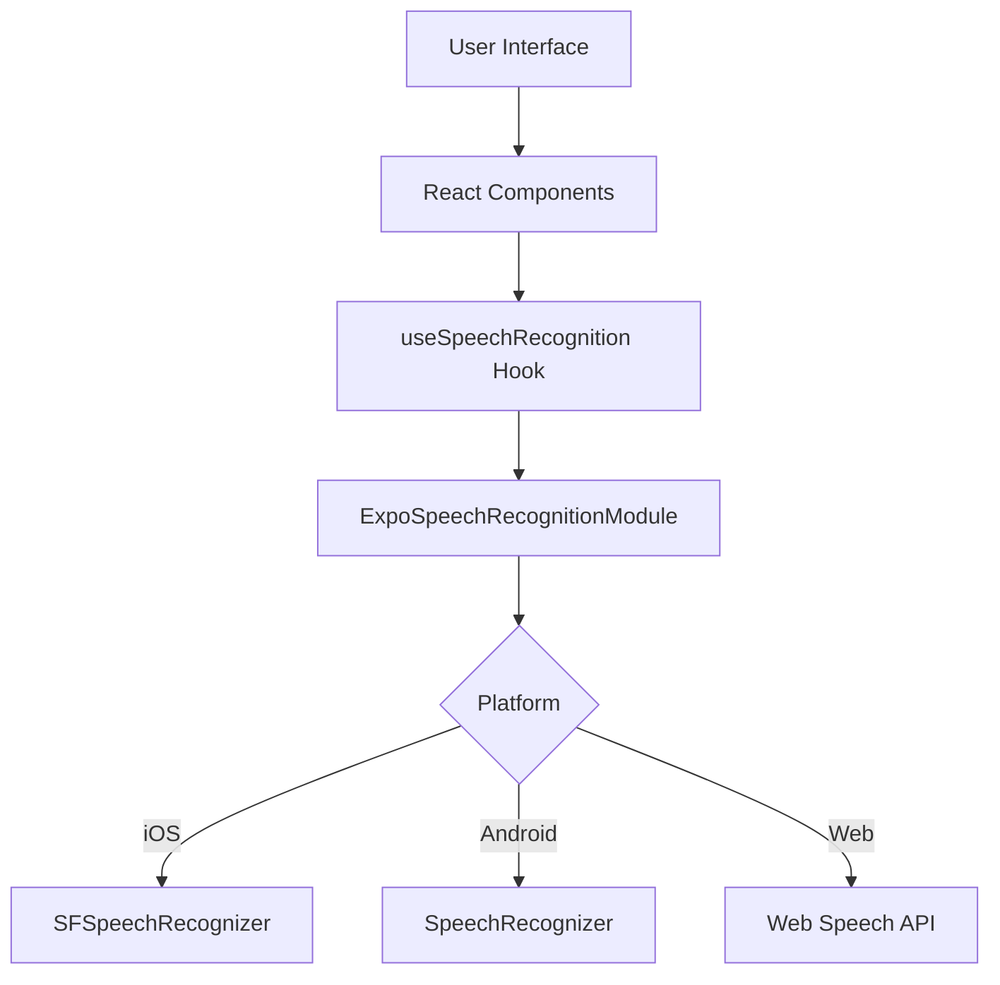
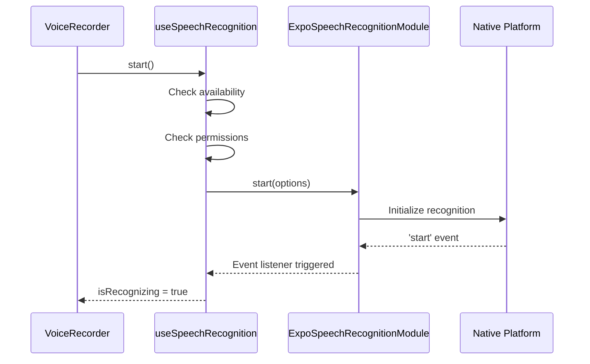
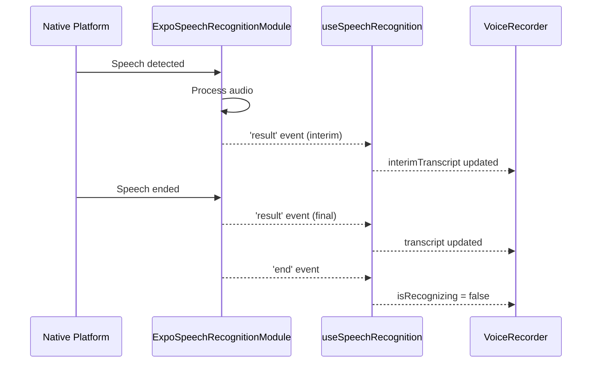
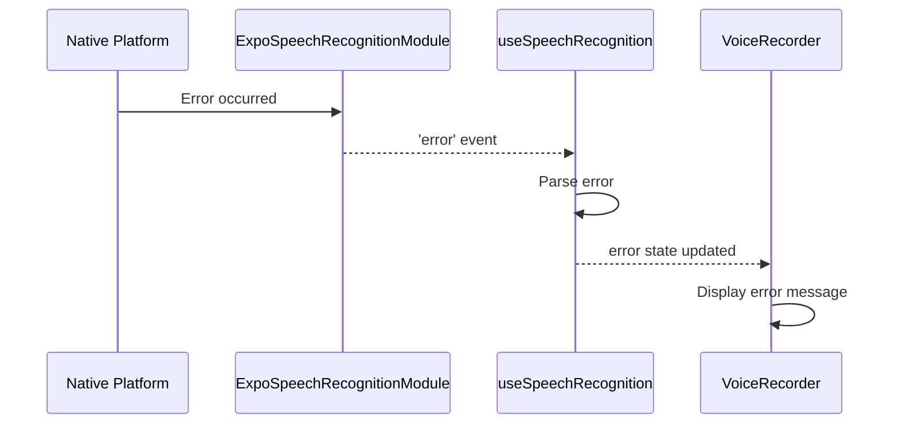

# Speech Recognition Architecture

## System Overview



## Layer Architecture

### 1. UI Layer (Components)
```
components/
├── VoiceRecorder.tsx          # Main voice recording UI
├── TargetPractice.tsx         # Target practice modal
└── __tests__/
    └── SpeechRecognitionTest.tsx  # Test component
```

**Purpose**: User interaction and visual feedback

**Responsibilities**:
- Display recording status
- Show interim/final transcripts
- Calculate and display accuracy
- Handle user actions (start/stop)

### 2. Hook Layer (React Integration)
```
hooks/
├── useSpeechRecognition.ts    # Speech recognition hook
└── useVoiceRecognition.ts     # Legacy TTS hook
```

**Purpose**: React-friendly API with state management

**Responsibilities**:
- Manage recognition state
- Handle permissions
- Provide easy-to-use methods
- Emit events to components

### 3. Service Layer (Business Logic)
```
services/
├── speechRecognition.ts       # Speech recognition service
└── voiceRecognition.ts        # Legacy service (unused)
```

**Purpose**: Cross-platform abstraction

**Responsibilities**:
- Abstract platform differences
- Provide unified API
- Handle event dispatching
- Manage cleanup

### 4. Native Layer (Platform APIs)
```
expo-speech-recognition (npm package)
├── iOS: SFSpeechRecognizer
├── Android: SpeechRecognizer
└── Web: Web Speech API
```

**Purpose**: Native speech recognition

**Responsibilities**:
- Capture audio
- Process speech
- Return transcripts
- Handle errors

## Data Flow

### Starting Recognition



### Receiving Results



### Error Handling



## Component Integration

### VoiceRecorder Component

```typescript
VoiceRecorder
├── Uses: useSpeechRecognition hook
├── Features:
│   ├── Real-time interim results
│   ├── Final transcription
│   ├── Accuracy calculation
│   └── Audio recording fallback
└── Props:
    ├── scriptureText: string
    └── onRecordingComplete: (accuracy: number) => void
```

### Flow:
1. User taps microphone button
2. Component calls `start()` from hook
3. Hook requests permissions if needed
4. Hook starts native recognition
5. Interim results appear in real-time
6. Final result triggers accuracy calculation
7. Callback fired with accuracy score

## State Management

### Hook State

```typescript
{
  // Recognition state
  isRecognizing: boolean,      // Currently listening?
  
  // Transcription
  transcript: string,          // Final transcript
  interimTranscript: string,   // Real-time transcript
  
  // Availability
  isAvailable: boolean,        // Platform supports it?
  hasPermission: boolean,      // Permission granted?
  
  // Errors
  error: string | null         // Current error
}
```

### Component State

```typescript
{
  // UI state
  accuracy: number,            // Calculated accuracy
  showAccuracy: boolean,       // Show result?
  statusMessage: string,       // User feedback
  
  // Audio fallback
  audioRecording: AudioRecordingResult | null,
  localTranscript: string
}
```

## Event Flow

```
┌─────────────────────────────────────────────────────┐
│                  User Action                        │
│              (Tap microphone button)                │
└─────────────────┬───────────────────────────────────┘
                  │
                  ▼
┌─────────────────────────────────────────────────────┐
│              Permission Check                       │
│         (useSpeechRecognition hook)                 │
└─────────────────┬───────────────────────────────────┘
                  │
                  ▼
┌─────────────────────────────────────────────────────┐
│           Start Recognition                         │
│    (ExpoSpeechRecognitionModule.start())           │
└─────────────────┬───────────────────────────────────┘
                  │
                  ▼
┌─────────────────────────────────────────────────────┐
│              'start' Event                          │
│         (isRecognizing = true)                      │
└─────────────────┬───────────────────────────────────┘
                  │
                  ▼
┌─────────────────────────────────────────────────────┐
│         'result' Events (interim)                   │
│      (interimTranscript updates)                    │
└─────────────────┬───────────────────────────────────┘
                  │
                  ▼
┌─────────────────────────────────────────────────────┐
│         'result' Event (final)                      │
│         (transcript updates)                        │
└─────────────────┬───────────────────────────────────┘
                  │
                  ▼
┌─────────────────────────────────────────────────────┐
│              'end' Event                            │
│         (isRecognizing = false)                     │
└─────────────────┬───────────────────────────────────┘
                  │
                  ▼
┌─────────────────────────────────────────────────────┐
│         Calculate Accuracy                          │
│      (Compare with scripture text)                  │
└─────────────────┬───────────────────────────────────┘
                  │
                  ▼
┌─────────────────────────────────────────────────────┐
│         Fire Callback                               │
│    (onRecordingComplete(accuracy))                  │
└─────────────────────────────────────────────────────┘
```

## Permission Flow

```
┌─────────────────────────────────────────────────────┐
│              App Launch                             │
└─────────────────┬───────────────────────────────────┘
                  │
                  ▼
┌─────────────────────────────────────────────────────┐
│         Check Availability                          │
│  (ExpoSpeechRecognitionModule.                     │
│   isRecognitionAvailable())                         │
└─────────────────┬───────────────────────────────────┘
                  │
                  ▼
┌─────────────────────────────────────────────────────┐
│         Check Current Permissions                   │
│  (getPermissionsAsync())                           │
└─────────────────┬───────────────────────────────────┘
                  │
        ┌─────────┴─────────┐
        │                   │
        ▼                   ▼
    Granted            Not Granted
        │                   │
        │                   ▼
        │         ┌─────────────────┐
        │         │ User Starts     │
        │         │ Recording       │
        │         └────────┬────────┘
        │                  │
        │                  ▼
        │         ┌─────────────────┐
        │         │ Request         │
        │         │ Permissions     │
        │         └────────┬────────┘
        │                  │
        │         ┌────────┴────────┐
        │         │                 │
        │         ▼                 ▼
        │    Granted           Denied
        │         │                 │
        └─────────┴─────────────────┤
                  │                 │
                  ▼                 ▼
          Start Recognition    Show Error
```

## Platform-Specific Implementations

### iOS
```
User Interface
      ↓
useSpeechRecognition Hook
      ↓
ExpoSpeechRecognitionModule
      ↓
Expo Native Module (Objective-C/Swift)
      ↓
SFSpeechRecognizer (Apple Framework)
      ↓
Audio Processing & Recognition
```

### Android
```
User Interface
      ↓
useSpeechRecognition Hook
      ↓
ExpoSpeechRecognitionModule
      ↓
Expo Native Module (Java/Kotlin)
      ↓
SpeechRecognizer (Android API)
      ↓
Google Speech Service
```

### Web
```
User Interface
      ↓
useSpeechRecognition Hook
      ↓
ExpoSpeechRecognitionModule
      ↓
Web Speech API (JavaScript)
      ↓
Browser Implementation (Chrome/Edge)
```

## File Dependencies

```
VoiceRecorder.tsx
├── Imports
│   ├── useSpeechRecognition (hook)
│   ├── useAudioRecording (fallback)
│   ├── useAppStore (settings)
│   └── expo-speech (TTS)
└── Exports
    └── VoiceRecorder component

useSpeechRecognition.ts
├── Imports
│   ├── ExpoSpeechRecognitionModule
│   └── useSpeechRecognitionEvent
└── Exports
    └── useSpeechRecognition hook

speechRecognition.ts
├── Imports
│   └── ExpoSpeechRecognitionModule
└── Exports
    └── speechRecognition service

ExpoSpeechRecognitionModule
├── Platform: iOS
│   └── SFSpeechRecognizer
├── Platform: Android
│   └── SpeechRecognizer
└── Platform: Web
    └── Web Speech API
```

## Configuration Chain

```
app.json
  ↓ (Build time)
expo-speech-recognition plugin
  ↓ (Generates)
Native configuration
  ├── iOS: Info.plist entries
  └── Android: AndroidManifest.xml permissions
      ↓ (Runtime)
ExpoSpeechRecognitionModule initialization
      ↓
useSpeechRecognition hook setup
      ↓
Component integration
```

---

This architecture provides:
- ✅ Clear separation of concerns
- ✅ Easy testing at each layer
- ✅ Platform abstraction
- ✅ Type safety throughout
- ✅ Reusable components and hooks
