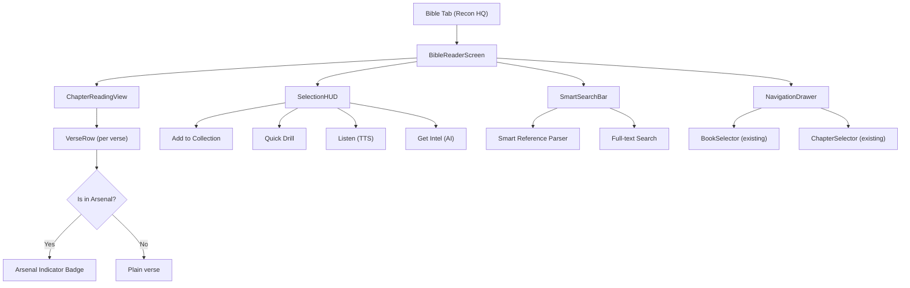

# Bible Reader — "Recon HQ"

A full-featured, immersive Bible reader deeply integrated with Spiritammo's memorization engine. Not just a reader — a **tactical reconnaissance tool** that bridges *reading* and *memorization* into one fluid workflow.

---

## User Review Required

> [!IMPORTANT]
> **New tab added.** This adds a 6th "Bible" tab to the main navigation. The existing 5 tabs remain unchanged. Expo Router + NativeTabs supports this, but review the tab icon choices below.

> [!WARNING]
> **Scope control.** This plan is structured in **3 phases**. Phase 1 is the core reader. Phases 2 and 3 are powerful enhancements that build on top. I recommend approving Phase 1 for immediate build, with Phases 2-3 as follow-ups.

---

## Architecture Overview



---

## Phase 1: Core Reader (Build Now)

### Navigation & Routing

#### [MODIFY] [_layout.tsx](file:///home/daniel/code/mobile/spiritammo/app/(tabs)/_layout.tsx)
- Add `bible` trigger between `battle` and `arsenal`
- Icon: `sf="text.book.closed.fill"` / `md="auto_stories"` (distinct from arsenal's `book.fill`)

#### [NEW] [bible.tsx](file:///home/daniel/code/mobile/spiritammo/app/(tabs)/bible.tsx)
Main screen with state machine:
- **States**: `browsing` → `reading` → `selecting`
- `browsing`: Show `BookSelector` + `ChapterSelector` (reuse existing) + smart search bar at top
- `reading`: Full chapter text with verse-level rendering
- `selecting`: When verses are tapped/long-pressed, show the Selection HUD

---

### Components

#### [NEW] `components/bible/BibleReaderScreen.tsx`
The main orchestrator component. Manages:
- Current book/chapter state
- Selected verses state (multi-select via `Set<string>`)
- Scroll position memory per chapter (so navigating back restores position)
- Integration with `bibleApiService` for chapter data

**Premium design details:**
- Parallax-style collapsing header showing `BOOK NAME • Chapter N` that shrinks on scroll
- Animated chapter transitions (fade + slight slide)
- Bottom-anchored "Selection HUD" that animates up when verses are selected

#### [NEW] `components/bible/VerseRow.tsx`
A single verse rendered with extreme care:

```
┌─────────────────────────────────────────────┐
│ ¹⁶  For God so loved the world, that he     │
│     gave his only begotten Son, that         │
│     whosoever believeth in him should not     │
│     perish, but have everlasting life.       │
│                                    🎯 ⚡ 92%  │
└─────────────────────────────────────────────┘
```

- **Verse number** rendered as superscript in accent color (monospace)
- **Verse text** in a warm, readable serif-like font (or high-legibility sans)
- **Arsenal indicator**: If this verse ID exists in `scriptures[]` from the store, show a small tactical badge:
  - 🎯 icon + accuracy percentage if practiced
  - ⚡ "IN ARSENAL" badge if added but not yet practiced
  - Subtle left-border glow in accent color for arsenal verses
- **Jesus Words**: Red-letter rendering using existing `ScriptureText` component's `isJesusWords` support
- **Selection state**: Tapping toggles selection with a smooth background highlight animation
- **Long press**: Opens a context menu with quick actions (Add to Arsenal, Listen, Share)

#### [NEW] `components/bible/SelectionHUD.tsx`
A floating tactical overlay at the bottom when verses are selected:

```
┌─────────────────────────────────────────────┐
│  3 TARGETS ACQUIRED                         │
│                                             │
│  [🎯 LOG ROUNDS]  [⚡ DRILL NOW]  [🔊 LISTEN] │
│  [🧠 GET INTEL]   [📋 COPY]                  │
└─────────────────────────────────────────────┘
```

- **LOG ROUNDS**: Opens collection picker → adds selected verses to arsenal + collection in one flow (reuses `CollectionSelector`)
- **DRILL NOW**: Immediately starts `TargetPractice` with the selected verse(s)
- **LISTEN**: Plays selected verses via existing `VoicePlaybackService` TTS
- **GET INTEL**: Fires `generateBattleIntel` for the selected verse, shows result inline
- **COPY**: Copies verse text + reference to clipboard
- Entrance animation: slide up with spring physics
- Exit animation: slide down on deselect

#### [NEW] `components/bible/SmartSearchBar.tsx`
Tactical search bar with smart parsing (inspired by Selah's parser but superior):

- **Smart reference parsing**: `Jn 3:16`, `John 3:16-18`, `Gen 1`, `1 Cor 13`, `Ps 23`
- **Full-text search**: Type any phrase → searches across all parsed verses in `bibleApiService`
- **Recent searches**: Persist last 10 searches in AsyncStorage
- **Auto-suggest**: As user types a book name, show completions from `BOOKS` array with fuzzy matching
- Uses the existing `BOOKS` mock with its full abbreviation arrays for comprehensive matching

#### [NEW] `components/bible/ChapterNavBar.tsx`
Horizontal chapter navigation strip between the header and the verse list:

```
 ◀  [1] [2] [3] [●4●] [5] [6] ... [28]  ▶
```

- Scrollable horizontal `FlatList` of chapter pills
- Current chapter highlighted with accent color
- Tap to jump to chapter, swipe to scroll through chapters
- Chapters containing arsenal verses get a subtle dot indicator below the number

---

### Service Enhancements

#### [MODIFY] [bibleApi.ts](file:///home/daniel/code/mobile/spiritammo/services/bibleApi.ts)
Add these methods to `BibleApiService`:

```typescript
// Full-text search across all loaded verses
async searchVerses(query: string, limit?: number): Promise<BibleVerse[]>

// Get all book names (derived from parsed data)  
getAvailableBooks(): string[]

// Get chapter count for a book (fast, from cache)
getChapterCountSync(book: string): number

// Parse a smart reference string → { book, chapter, startVerse?, endVerse? }
static parseReference(input: string): ParsedReference | null
```

The `searchVerses` method is critical — it enables full-text Bible search, which neither app currently has well. It searches the in-memory `parsedVerses` Map, making it instant (<5ms for full Bible scan).

---

### Deep Integration Points

#### [MODIFY] [AmmunitionCard.tsx](file:///home/daniel/code/mobile/spiritammo/components/AmmunitionCard.tsx)
Add a "VIEW IN CONTEXT" button to the action grid. When pressed, navigates to the Bible tab with the verse's book + chapter pre-loaded and the verse scrolled into view + highlighted.

#### [NEW] `hooks/useBibleReader.ts`
Central hook managing Bible reader state:
- Current book, chapter, scroll position
- Selected verses
- Arsenal lookup (efficient `Set<string>` of verse IDs from `scriptures[]`)
- Navigation history stack (back button support)
- `navigateToVerse(book, chapter, verse)` — used by deep links from AmmunitionCard, etc.

---

## Phase 2: Intelligence Layer (Build Next)

### AI-Powered Chapter Insights

#### [NEW] `components/bible/ChapterInsightCard.tsx`
At the top of each chapter, an optional collapsible card:
- **AI Summary**: One-sentence contextual summary of the chapter (generated via `battleIntelligence` service)
- **Historical Context**: Brief military-themed historical note
- **Key Themes**: Tag-style pills (e.g., `FAITH`, `LOVE`, `WARFARE`)
- Cached in AsyncStorage per chapter to avoid re-generation

### Cross-Reference Navigator

#### [NEW] `components/bible/CrossReferencePanel.tsx`
When a verse is selected, show related verses:
- Leverages the existing `crossReferenceBriefings` from the briefing slice
- Shows a horizontal scroll of related verse cards
- Tap a card → navigates to that verse in the reader

### Reading Plans Integration

#### [NEW] `services/readingPlanService.ts`
- "Daily Recon" — auto-generated daily chapter for reading
- "Context Ops" — when user is memorizing Eph 6:10-18, this suggests reading Eph 5-6 for full context
- Progress tracked in AsyncStorage
- Surfaced on the Home screen as a new briefing card

---

## Phase 3: Polish & Power Features (Future)

### Font & Display Settings
- Font size slider (14-28px)
- Font family choice (Serif, Sans, Monospace)
- Line spacing adjustment
- Persisted in `userSettings`

### Chapter Swipe Navigation
- Horizontal swipe gesture to move between chapters
- Integrates with `react-native-gesture-handler` (already installed)
- Haptic feedback on chapter change

### Verse Highlights & Notes
- Color-coded highlighting system (4 colors)
- Personal notes per verse
- Both persisted in SQLite via new `highlights` and `notes` tables

### Offline Bible Search
- Pre-build a search index on first launch (background task)
- Trie-based prefix search for instant results
- Fuzzy matching for misspellings

### "Listen to Chapter" Mode
- Sequential TTS playback of entire chapter
- Auto-scroll follows the currently-spoken verse
- Karaoke-style highlight of active verse
- Pause/resume controls
- Uses existing `VoicePlaybackService` infrastructure

### Share as Image
- Long-press a verse → "Share as Image"
- Generates a beautiful card image with the verse text, reference, and tactical branding
- Uses `react-native-view-shot` or canvas rendering

---

## Proposed Changes Summary (Phase 1)

### Navigation
| File | Action | Description |
|------|--------|-------------|
| [_layout.tsx](file:///home/daniel/code/mobile/spiritammo/app/(tabs)/_layout.tsx) | MODIFY | Add Bible tab trigger |

### New Files
| File | Description |
|------|-------------|
| `app/(tabs)/bible.tsx` | Bible tab screen |
| `components/bible/BibleReaderScreen.tsx` | Main reader orchestrator |
| `components/bible/VerseRow.tsx` | Individual verse renderer with arsenal awareness |
| `components/bible/SelectionHUD.tsx` | Floating action bar for selected verses |
| `components/bible/SmartSearchBar.tsx` | Smart reference parser + full-text search |
| `components/bible/ChapterNavBar.tsx` | Horizontal chapter strip navigator |
| `hooks/useBibleReader.ts` | Central Bible reader state hook |

### Modified Files
| File | Description |
|------|-------------|
| [bibleApi.ts](file:///home/daniel/code/mobile/spiritammo/services/bibleApi.ts) | Add search, parsing, and chapter count methods |
| [AmmunitionCard.tsx](file:///home/daniel/code/mobile/spiritammo/components/AmmunitionCard.tsx) | Add "View in Context" deep link to Bible reader |

---

## What Makes This Superior

| Feature | Selah | Current Spiritammo | **New Bible Reader** |
|---------|-------|-------------------|---------------------|
| Full chapter reading | ❌ | ❌ | ✅ Immersive reading view |
| Smart reference parsing | ✅ Basic | ❌ | ✅ Superior (fuzzy + abbreviations) |
| Full-text Bible search | ❌ | ❌ | ✅ Instant in-memory search |
| Neighboring verses | ✅ 3 before/after | ❌ | ✅ Full chapter context |
| Arsenal awareness | N/A | N/A | ✅ Inline mastery badges |
| One-tap memorize | ❌ | Requires modal | ✅ Selection HUD |
| Quick drill from reader | ❌ | ❌ | ✅ Instant TargetPractice |
| TTS from reader | ❌ | ❌ | ✅ Listen to selection |
| AI insights | ❌ | ❌ | ✅ Battle Intel integration |
| Deep linking from cards | ❌ | ❌ | ✅ "View in Context" |
| Version switching | ✅ Multiple | KJV only | KJV (expandable) |

---

## Verification Plan

### Automated Tests
- Unit test `parseReference()` with edge cases: `"Jn 3:16"`, `"1 Cor 13:4-8"`, `"Ps 119"`, `"Song of Solomon 2:1"`
- Unit test `searchVerses()` for both exact and partial matches
- Verify arsenal lookup Set is correctly populated from store

### Manual Verification
1. Open Bible tab → browse to John 3 → see full chapter text
2. Tap verse 16 → see Selection HUD appear with tactical animation
3. Tap "LOG ROUNDS" → pick collection → verify verse appears in Arsenal
4. Go to Arsenal → find John 3:16 card → tap "VIEW IN CONTEXT" → lands on John 3 with v16 highlighted
5. Long-press verse → see context menu
6. Type "Jn 3:16" in search → verify instant navigation
7. Type "love" in search → see search results across Bible
8. Verify arsenal verses show mastery badges inline in the reading view
