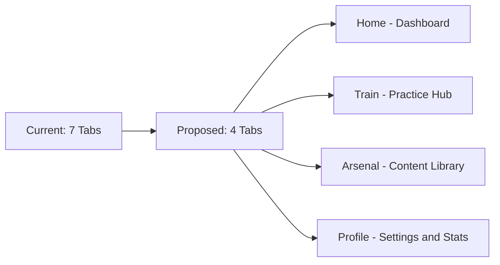
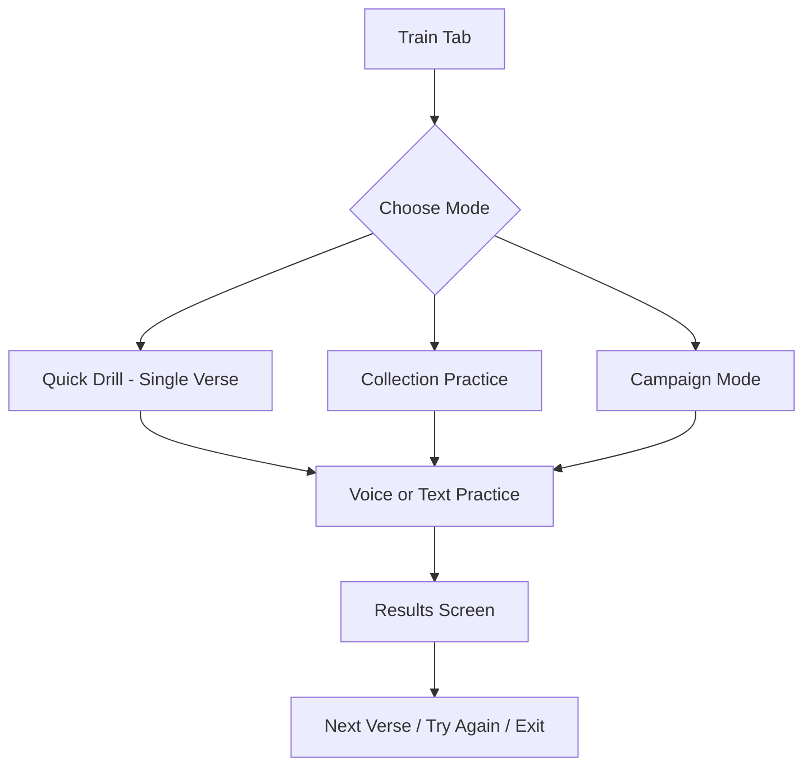

# SpiritAmmo UX Improvement Plan

## Executive Summary

The current SpiritAmmo app suffers from **feature overload** and **navigation complexity** that overwhelms new users. This plan outlines a phased approach to simplify the user experience while maintaining the app's unique military theme and powerful features.

---

## Current Issues Identified

### 1. Navigation Overload
- **7 bottom tabs**: Home, Arsenal, Training, Conquest, Squad, Report, Settings
- Users are presented with too many choices at once
- No clear "starting point" for new users

### 2. Redundant Navigation Paths
- Home screen contains cards that link to other tabs (Conquest Mode → Campaign tab, Collection Drills → Campaign tab)
- Creates confusion about where users "are" in the app
- Same features accessible from multiple places without clear distinction

### 3. Inconsistent Naming Convention
| Tab Name | Screen Header | User Confusion |
|----------|---------------|----------------|
| Conquest | Campaign | Different names for same section |
| Settings | Command Post | Unexpected naming |
| Home | Command Center | Military jargon inconsistency |

### 4. Feature Density Per Screen
- **Home screen**: 4 mission cards + 2 quick actions + avatar + streak challenge
- **Arsenal screen**: 3 tabs (Ammunition, Equipment, Voice) with multiple sub-features
- **Training screen**: Multiple modes, collection selectors, intel generation
- **Campaign screen**: Campaign mode + Collection mode + multiple practice types

### 5. Complex Onboarding
- Welcome modal with typewriter effect
- Tutorial overlay with military terminology
- No progressive feature disclosure

### 6. Military Jargon Barrier
- Terms like "Intel", "Ammunition", "Conquest", "Barracks" may confuse non-military users
- Inconsistent application of theme

### 7. Incomplete Features Visible
- Squad tab shows "Coming Soon"
- Creates impression of unfinished product

---

## Proposed Solutions

### Phase 1: Navigation Simplification

#### 1.1 Reduce Tab Bar to 4 Core Tabs



**New Tab Structure:**
| New Tab | Contains | Icon |
|---------|----------|------|
| **Home** | Dashboard with daily goals, quick start, progress | Home |
| **Train** | All practice modes, campaigns, drills | Target |
| **Arsenal** | Collections, scriptures, voice library | Book |
| **Profile** | Avatar, settings, stats, squad | User |

#### 1.2 Consolidate Related Screens

- Merge `Training` and `Campaign` into single **Train** hub
- Move `Mission Report` into **Profile** tab
- Move `Squad` into **Profile** tab (as "Social" or "Squad" section)
- Hide incomplete features until ready

### Phase 2: Home Screen Redesign

#### 2.1 Single Clear Call-to-Action

```
┌─────────────────────────────────────┐
│         COMMAND CENTER              │
│                                     │
│  ┌─────────────────────────────┐   │
│  │    🎯 START DAILY DRILL     │   │
│  │    Your verse for today     │   │
│  │    John 3:16                │   │
│  └─────────────────────────────┘   │
│                                     │
│  ┌─────────┐ ┌─────────┐          │
│  │ Streak  │ │ Rank    │          │
│  │  7 🔥   │ │ Sgt     │          │
│  └─────────┘ └─────────┘          │
│                                     │
│  Recent Activity                    │
│  ├─ Collection Drills completed     │
│  └─ New verse added                 │
│                                     │
└─────────────────────────────────────┘
```

#### 2.2 Progressive Disclosure

**Level 1 (New Users - First 3 Days):**
- Single "Start Drill" button
- One pre-loaded verse collection
- Basic progress tracking

**Level 2 (Active Users - 3-7 Days):**
- Unlock "Collections" feature
- Add custom verses
- View detailed stats

**Level 3 (Engaged Users - 7+ Days):**
- Unlock "Campaigns" 
- Access "Voice Recording"
- Full feature access

### Phase 3: Simplify Training Flow

#### 3.1 Unified Training Hub



#### 3.2 Remove Redundant Options

- Combine "Target Practice" and "Stealth Drill" into single practice interface
- Mode selection happens after verse selection, not before
- Auto-recommend practice type based on verse length

### Phase 4: Arsenal Consolidation

#### 4.1 Simplified Content Management

**Current Structure:**
- Ammunition tab (Collections, Books, Chapters)
- Equipment tab (Avatar items)
- Voice tab (Recordings)

**Proposed Structure:**
```
Arsenal
├── 📚 My Collections
│   ├── System Collections (pre-loaded)
│   └── Custom Collections
├── ➕ Add Content
│   ├── Import from PDF
│   ├── Add Single Verse
│   └── Browse by Book
├── 🎙️ Voice Recordings
└── 👤 Avatar (collapsed by default)
```

### Phase 5: Onboarding Improvements

#### 5.1 Streamlined Welcome Flow

**Current:** Welcome Modal → Tutorial Overlay → Home Screen
**Proposed:** Interactive First Drill → Contextual Tips

```
Step 1: "Welcome! Let's memorize your first verse."
        [Shows verse on screen]
        
Step 2: "Read it out loud or silently. Tap when ready."
        [User reads, taps 'Ready']
        
Step 3: "Now let's test your memory. Speak or type what you remember."
        [Practice interface]
        
Step 4: "Great job! You've completed your first drill."
        [Show results, unlock next feature]
```

#### 5.2 Contextual Help

- Replace tutorial overlay with inline tips
- Add help icon (❓) that shows contextual help
- First-time feature hints that dismiss after use

### Phase 6: Consistent Terminology

#### 6.1 User-Friendly Language Map

| Current Term | User-Friendly Alternative | Context |
|--------------|---------------------------|---------|
| Ammunition | Verses / Scriptures | Content |
| Intel | Memory Hints | Practice |
| Conquest Mode | Campaign Mode | Feature |
| Squad Ops | Squad Challenges | Social |
| Command Post | Settings | Settings |
| Arsenal | Library | Navigation |

#### 6.2 Gradual Theme Introduction

- Start with simple language
- Introduce military terms progressively
- Add glossary in settings for reference

---

## Implementation Priority

### High Priority (Week 1-2)
1. ✅ Reduce tabs from 7 to 4
2. ✅ Redesign home screen with single CTA
3. ✅ Hide incomplete features (Squad)
4. ✅ Simplify onboarding flow

### Medium Priority (Week 3-4)
5. ⬜ Consolidate Training and Campaign screens
6. ⬜ Implement progressive disclosure system
7. ⬜ Add contextual help system

### Low Priority (Week 5-6)
8. ⬜ Refine terminology throughout app
9. ⬜ Add feature unlock animations
10. ⬜ Create user preference for theme intensity

---

## Success Metrics

| Metric | Current Baseline | Target |
|--------|------------------|--------|
| First session completion rate | TBD | 80% |
| Time to first drill completion | TBD | < 2 minutes |
| Day 7 retention | TBD | 40% |
| Feature discovery rate | TBD | 60% within 7 days |
| User confusion reports | High | Minimal |

---

## Technical Implementation Notes

### Files to Modify

1. **Navigation Structure**
   - [`app/(tabs)/_layout.tsx`](app/(tabs)/_layout.tsx) - Reduce tabs
   - [`components/TabBar.tsx`](components/TabBar.tsx) - Update tab icons

2. **Home Screen**
   - [`app/(tabs)/index.tsx`](app/(tabs)/index.tsx) - Simplify layout
   - Remove redundant navigation cards

3. **Training Consolidation**
   - Merge [`app/(tabs)/training.tsx`](app/(tabs)/training.tsx) and [`app/(tabs)/campaign.tsx`](app/(tabs)/campaign.tsx)
   - Create unified training hub

4. **Onboarding**
   - [`components/WelcomeModal.tsx`](components/WelcomeModal.tsx) - Simplify
   - [`components/TutorialOverlay.tsx`](components/TutorialOverlay.tsx) - Replace with contextual tips

5. **Settings/Profile**
   - [`app/(tabs)/settings.tsx`](app/(tabs)/settings.tsx) - Add stats, squad section

### New Components Needed

1. `components/QuickStartCard.tsx` - Single CTA for home screen
2. `components/ProgressiveFeature.tsx` - Wrapper for locked features
3. `components/ContextualTip.tsx` - Inline help system
4. `components/TrainingHub.tsx` - Unified training entry point

---

## Questions for Stakeholder

1. **Tab Reduction**: Are there any tabs that must remain separate for business reasons?
2. **Feature Hiding**: Is it acceptable to hide Squad features until fully implemented?
3. **Theme Intensity**: Should we offer a "Lite Mode" with less military terminology?
4. **Progressive Disclosure**: What should be the unlock criteria for features?
5. **Analytics**: Should we track user confusion metrics specifically?

---

## Next Steps

1. Review and approve this plan
2. Prioritize phases based on resources
3. Create detailed design mockups for Phase 1
4. Implement navigation changes
5. Test with new users
6. Iterate based on feedback
